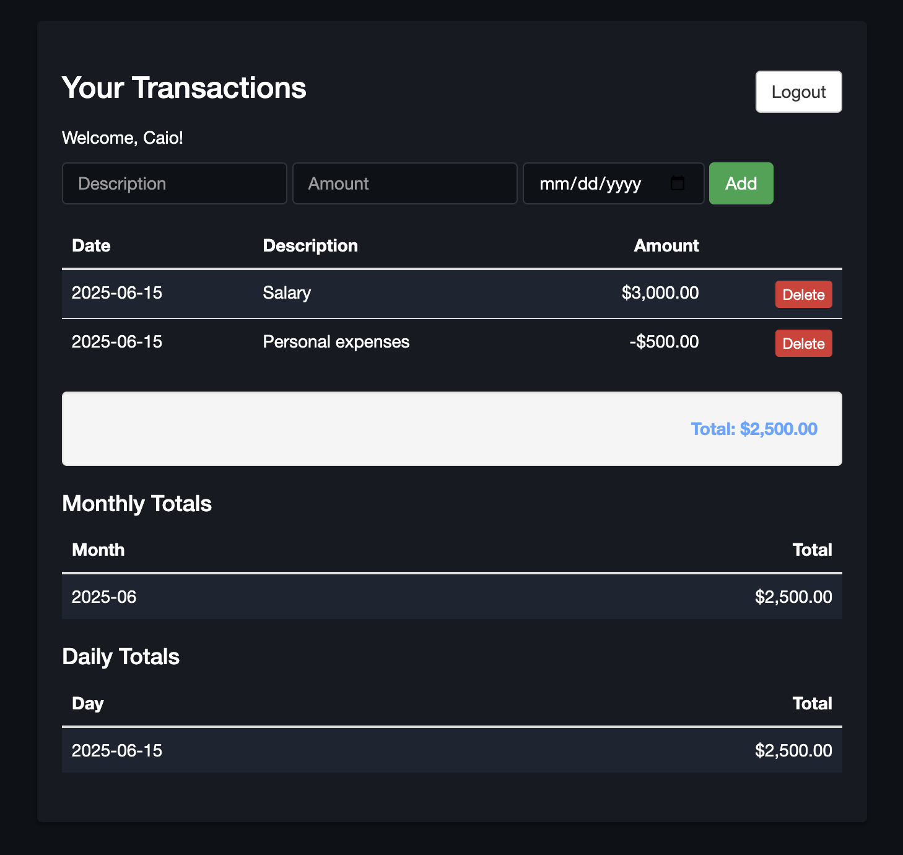
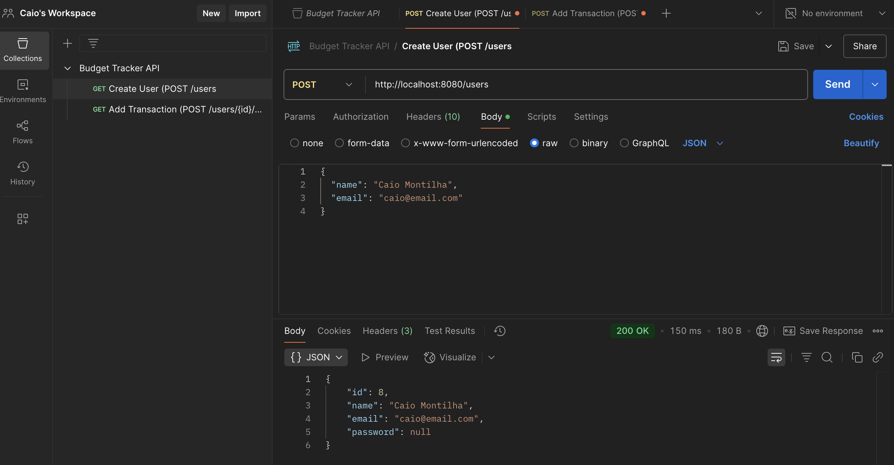

# 💰 Budget Tracker

A full-stack budgeting application built with a **Java Dropwizard backend** and an **AngularJS 1.x frontend**. Users can register, log in, add financial transactions, and view total spending by day and month. The goal is to practice full-stack development using Java APIs and lightweight web technologies.

---

## Project Progress Overview

| Step                                                                 | Status                                          |
|----------------------------------------------------------------------|-------------------------------------------------|
|  Project structure and repository setup                            | ✅ Completed                                     |
|  Backend (Dropwizard + Hibernate + REST endpoints)                 |  Partially Completed *(review required)*        |
|  User registration and login system (form → API → DB)              | ️ In Progress *(current state)*                 |
|  Transaction management: Add, list, user relation                  | ️ Partially Completed *(user-specific scope unclear)* |
|  UI development (AngularJS, Bootstrap, Dark Mode styling)         | ️ Partially Completed *(design improvements pending)* |
|  Frontend + backend integration tested via Postman & browser       | ️ In Progress                                   |
|  UX polishing and error handling (form validation, alerts)         |  Coming Soon                                    |
|  Deployment (GitHub Pages or server + API hosting)                |  Coming Soon                                    |
|  Demo video and screenshots                                        |  Coming Soon                                    |

---

## ⚙️ Backend Setup (Dropwizard)

The backend provides a RESTful API using Dropwizard and Hibernate. It handles user creation and transaction storage.
```
cd backend
mvn clean package
java -jar target/budget-tracker-api-1.0-SNAPSHOT.jar server config.yml
```
- Server runs at: http://localhost:8080

### Key Endpoints (to confirm)
- POST /users – Create user

- GET /users/{id} – Get user by ID

- POST /transactions – Add transaction

- GET /transactions?userId={id} – List transactions by user

Frontend Setup (AngularJS + Bootstrap)
The frontend is a lightweight AngularJS application styled with Bootstrap 3 and custom dark mode styles.

### Run Frontend
You can use any static server, such as http-server or Python's built-in one:

```
# Option 1: Using http-server
cd frontend
http-server -p 5500

# Option 2: Using Python (if installed)
cd frontend
python3 -m http.server 5500
```
- Visit the app at: http://localhost:5500

---

### Features
✅ Registration form with name, email, password

⚠️ Login form not yet validating credentials with the API

✅ Dashboard with:
- Transaction form

- Date picker

- List of added transactions

- Total, monthly, and daily summaries

⚠️ UX polish, validations, and error messages still in progress

✅ Dark mode with Bootstrap + custom styling

---

## 📸 Demonstration

- Dashboard: List of transactions added by the user with total calculations per day and month.



<br>

- Postman: Testing the API endpoint for creating a user with name and email.



---

## 📁 Project Structure
```
budget-tracker-api/
├── backend/        # Java backend: Dropwizard + Hibernate
│   └── src/...
├── frontend/       # AngularJS frontend (HTML, JS, CSS)
│   ├── controllers/
│   ├── services/
│   ├── views/
│   └── index.html
├── config.yml
└── README.md
```
--- 

### Notes
- The project is functional for local testing.

- Some backend integration and validations still need refinement.

- Deployment and final polish are the next steps.

---

## License

This project is licensed under the MIT License.